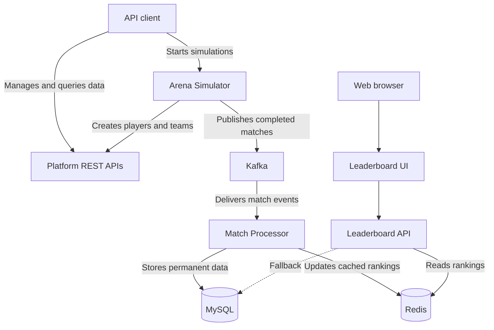
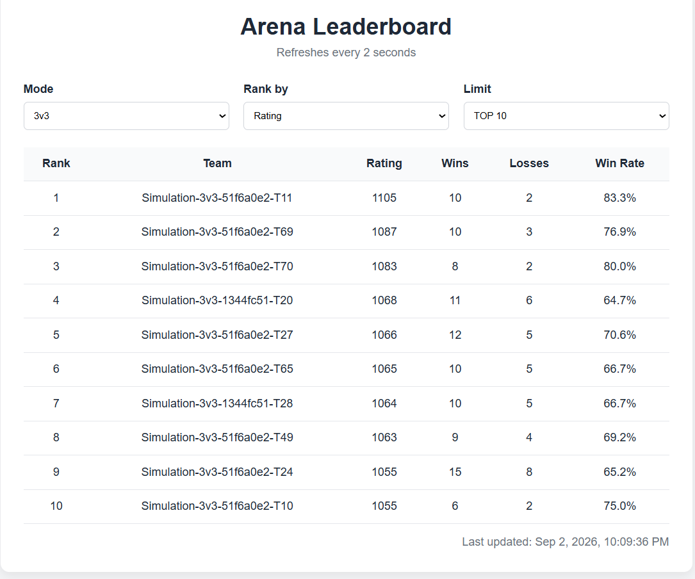
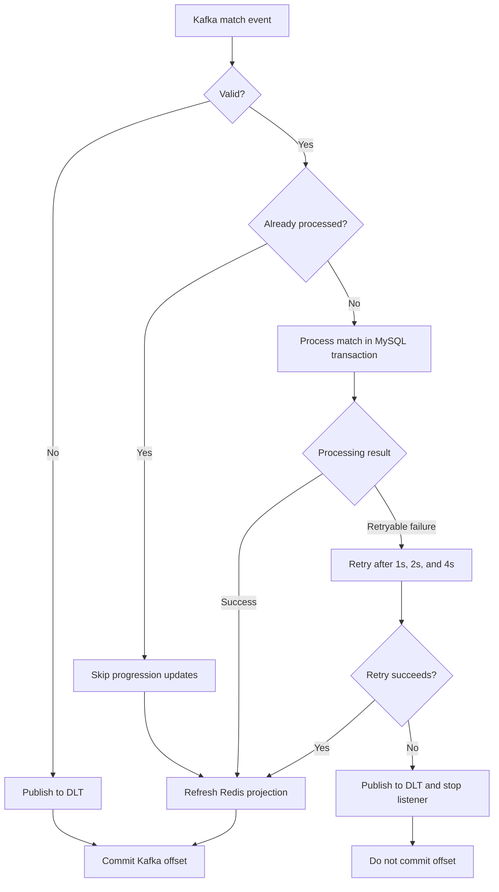
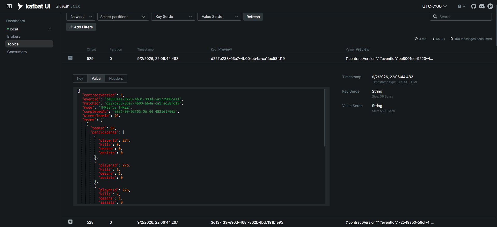
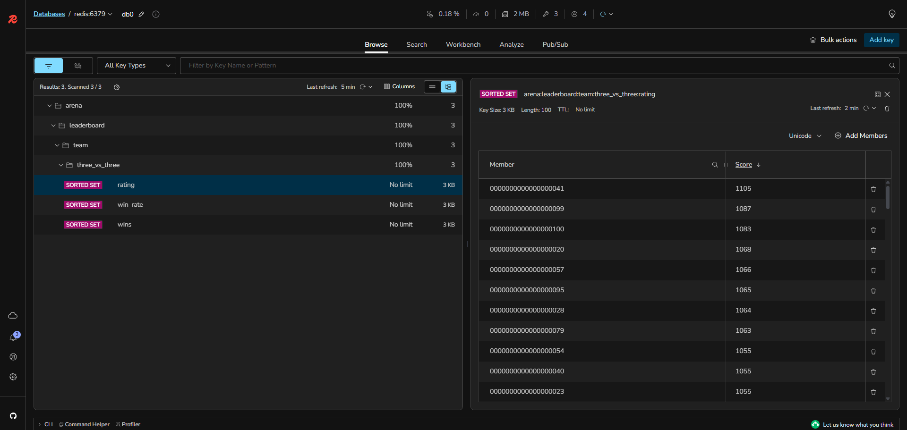

# Arena Progression Platform

[](https://github.com/yanfan-lin/arena-progression-platform/actions/workflows/ci.yml)

A backend application that processes simulated arena matches through Kafka, stores player and team progression in MySQL,
and serves near-live leaderboards from Redis.

## Features

| Area              | Capability                                                                                          |
|-------------------|-----------------------------------------------------------------------------------------------------|
| Players and teams | Create players, manage team rosters, and activate or retire 3v3 and 5v5 teams                       |
| Match simulation  | Generate matches on request or on a schedule                                                        |
| Event processing  | Process Kafka match events with validation, retries, dead-letter handling, and duplicate protection |
| Progression       | Store each match and update player progression and team ratings in one MySQL transaction            |
| Query APIs        | Retrieve player profiles, match details, match history, and team rankings                           |
| Redis             | Cache player profiles and serve Redis leaderboards with MySQL fallback and automatic rebuilds       |
| Leaderboard UI    | Display near-live team rankings with 2-second refreshes                                             |

## Architecture

The simulator generates match events, while the platform processes them and stores results permanently in MySQL.



MySQL stores the source data, Kafka may redeliver events, duplicate processing is prevented, and Redis can be rebuilt
from MySQL.

## Modules

| Module                 | Responsibility                                                                                                    |
|------------------------|-------------------------------------------------------------------------------------------------------------------|
| `arena-contract`       | Defines the match event format and Kafka topic names shared by the simulator and platform                         |
| `progression-platform` | Manages players and teams, processes match events, stores results, and provides query APIs and the leaderboard UI |
| `arena-simulator`      | Prepares teams and publishes generated matches, either on request or on a schedule                                |

## Tech Stack

| Area                 | Technology                              |
|----------------------|-----------------------------------------|
| Backend              | Java 25, Spring Boot 4.1                |
| Messaging            | Apache Kafka 4.3                        |
| Database             | MySQL 8.4, Flyway                       |
| Cache                | Redis 7.4                               |
| Testing              | JUnit, Mockito, MockMvc, Testcontainers |
| Build and containers | Maven, Docker Compose                   |
| CI                   | GitHub Actions                          |
| UI                   | HTML, CSS, JavaScript                   |

## Local Setup

### Requirements

- Java 25
- Docker

Maven does not need to be installed because the repository includes the Maven wrapper.

### 1. Clone the repository

```bash
git clone https://github.com/yanfan-lin/arena-progression-platform.git
cd arena-progression-platform
```

### 2. Create the environment file

**Windows PowerShell**

```powershell
Copy-Item .env.example .env
```

**macOS/Linux**

```bash
cp .env.example .env
```

The default application settings match the MySQL credentials in `.env`. If you change them, configure
`progression-platform` with the same values.

### 3. Start MySQL, Kafka, and Redis

```bash
docker compose up -d
```

Wait until all three containers are healthy:

```bash
docker compose ps
```

### 4. Build the applications

**Windows PowerShell**

```powershell
.\mvnw.cmd clean package -DskipTests
```

**macOS/Linux**

```bash
./mvnw clean package -DskipTests
```

### 5. Start the progression platform

Open a new terminal:

```bash
java -jar progression-platform/target/progression-platform-0.0.1-SNAPSHOT.jar
```

### 6. Start the arena simulator

After the progression platform has started, open another terminal:

```bash
java -jar arena-simulator/target/arena-simulator-0.0.1-SNAPSHOT.jar
```

The progression platform starts first because the simulator calls its APIs to create players and teams.

### 7. Verify the project

Docker must be running because the integration tests use Testcontainers.

**Windows PowerShell**

```powershell
.\mvnw.cmd clean verify
```

**macOS/Linux**

```bash
./mvnw clean verify
```

### Web URLs

| Resource                   | URL                                      |
|----------------------------|------------------------------------------|
| Leaderboard                | `http://localhost:8081/leaderboard.html` |
| Platform health            | `http://localhost:8081/actuator/health`  |
| Leaderboard rebuild status | `http://localhost:8081/actuator/info`    |
| Platform metrics           | `http://localhost:8081/actuator/metrics` |
| Kafka dashboard            | `http://localhost:8080`                  |
| Redis dashboard            | `http://localhost:5540`                  |

Start the optional Kafka and Redis dashboards with:

```bash
docker compose --profile tools up -d
```

## Simulation Walkthrough

### 1. Set up teams

Set up teams with `POST`:

```text
http://localhost:8082/api/v1/simulations/setup
```

Use `Content-Type: application/json` with this body:

```json
{
  "mode": "THREE_VS_THREE",
  "targetTeamCount": 30
}
```

The response shows the existing team count and how many teams and players were added.

### 2. Start a simulation run

Start the run with `POST`:

```text
http://localhost:8082/api/v1/simulations/runs
```

Use this JSON body:

```json
{
  "mode": "THREE_VS_THREE",
  "intervalMs": 1000,
  "maxMatches": 30
}
```

The simulator returns `202 Accepted` and begins publishing one match approximately every second.

### 3. Check the run

Check its progress with `GET`:

```text
http://localhost:8082/api/v1/simulations/runs/current
```

The response shows the run status, progress, and latest event and match IDs.

### 4. View the leaderboard

Open the leaderboard in a browser:

```text
http://localhost:8081/leaderboard.html
```

Select `3v3` to view the teams updated by the simulation. The leaderboard refreshes automatically.



### 5. Stop the run

A run stops automatically after publishing its configured number of matches. To stop it earlier, send a `DELETE` request
to:

```text
http://localhost:8082/api/v1/simulations/runs/current
```

Use `FIVE_VS_FIVE` instead of `THREE_VS_THREE` in both POST requests to simulate 5v5 matches.

## Kafka Processing



| Event outcome                | Platform behavior                                      | Kafka offset                                       |
|------------------------------|--------------------------------------------------------|----------------------------------------------------|
| Valid event                  | Store the match and progression updates                | Committed                                          |
| Duplicate event              | Skip duplicate updates                                 | Committed                                          |
| Permanent failure            | Send it to the dead-letter topic                       | Committed after the dead-letter event is published |
| Retryable failure            | Retry after 1s, 2s, and 4s                             | Committed if a retry succeeds                      |
| Retries exhausted            | Send it to the dead-letter topic and stop the listener | Not committed                                      |
| Dead-letter publishing fails | Stop the listener                                      | Not committed                                      |



## Redis Caching and Leaderboards

| Redis use            | Behavior                                                               |
|----------------------|------------------------------------------------------------------------|
| Player profiles      | Cache profiles after MySQL reads                                       |
| Team leaderboards    | Store rating, wins, and win rate in sorted sets                        |
| Fallback and rebuild | Read from MySQL when Redis is unavailable and rebuild Redis from MySQL |



## API Reference

Send these requests using an HTTP client.

### Progression Platform

Base URL: `http://localhost:8081`

| Method | Endpoint                                   | Purpose                      |
|--------|--------------------------------------------|------------------------------|
| `POST` | `/api/v1/players`                          | Create a player              |
| `GET`  | `/api/v1/players/{playerId}`               | Get a player profile         |
| `POST` | `/api/v1/players/{playerId}/retire`        | Retire a player              |
| `GET`  | `/api/v1/players/{playerId}/matches`       | Get a player’s match history |
| `POST` | `/api/v1/teams`                            | Create a team                |
| `GET`  | `/api/v1/teams/{teamId}`                   | Get a team                   |
| `PUT`  | `/api/v1/teams/{teamId}/roster`            | Replace a team roster        |
| `POST` | `/api/v1/teams/{teamId}/activate`          | Activate a team              |
| `POST` | `/api/v1/teams/{teamId}/retire`            | Retire a team                |
| `GET`  | `/api/v1/teams/{teamId}/matches`           | Get a team’s match history   |
| `GET`  | `/api/v1/matches/{matchId}`                | Get match details            |
| `GET`  | `/api/v1/leaderboards/teams`               | Get a team leaderboard       |
| `GET`  | `/api/v1/leaderboards/teams/{teamId}/rank` | Get a team’s exact rank      |

Leaderboard queries support:

- Modes: `THREE_VS_THREE`, `FIVE_VS_FIVE`
- Ranking metrics: `RATING`, `WINS`, `WIN_RATE`
- Limits: `10`, `30`, `50`, `100`

Player and team match histories support `page` and `size` query parameters.

### Arena Simulator

Base URL: `http://localhost:8082`

| Method   | Endpoint                                  | Purpose                                     |
|----------|-------------------------------------------|---------------------------------------------|
| `POST`   | `/api/v1/simulations/setup`               | Create teams and players for one arena mode |
| `POST`   | `/api/v1/simulations/matches?mode={mode}` | Generate and publish one match              |
| `POST`   | `/api/v1/simulations/runs`                | Start scheduled match generation            |
| `GET`    | `/api/v1/simulations/runs/current`        | Get the current or most recent run          |
| `DELETE` | `/api/v1/simulations/runs/current`        | Stop the current run                        |
