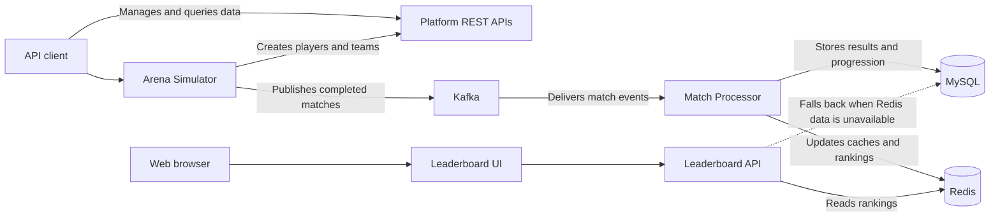

# Arena Progression Platform

A backend application that simulates 3v3 and 5v5 arena matches, processes their results, and updates player progression,
team ratings, match history, and leaderboards.

## Features

| Area              | Capability                                                                                                   |
|-------------------|--------------------------------------------------------------------------------------------------------------|
| Players and teams | Create players, manage team rosters, and activate or retire 3v3 and 5v5 teams                                |
| Match simulation  | Generate one match on request or run scheduled match simulations                                             |
| Event processing  | Consume at-least-once Kafka events with validation, retries, dead-letter handling, and idempotent processing |
| Progression       | Store match results and update player progression and team ratings transactionally in MySQL                  |
| Query APIs        | Retrieve player profiles, match details, match history, and team rankings                                    |
| Redis             | Cache player profiles and maintain leaderboards with MySQL fallback and rebuild support                      |
| Demonstration     | Display team rankings through an automatically refreshing leaderboard                                        |

## Architecture

The project separates match generation from match processing while keeping MySQL as the permanent data store.

## Project Modules

| Module                 | Responsibility                                                                                                      |
|------------------------|---------------------------------------------------------------------------------------------------------------------|
| `arena-contract`       | Shares the match event format and Kafka topic names between the simulator and platform                              |
| `progression-platform` | Manages players and teams, processes match events, stores results, and provides query APIs and the leaderboard UI   |
| `arena-simulator`      | Creates players and teams, generates completed matches, publishes them to Kafka, and schedules repeated simulations |

## Tech Stack

| Area                 | Technology                              |
|----------------------|-----------------------------------------|
| Backend              | Java 25, Spring Boot 4.1                |
| Messaging            | Apache Kafka 4.3                        |
| Database             | MySQL 8.4, Flyway                       |
| Cache                | Redis 7.4                               |
| Testing              | JUnit, Mockito, MockMvc, Testcontainers |
| Build and containers | Maven, Docker Compose                   |
| CI                   | GitHub Actions                          |
| UI                   | HTML, CSS, JavaScript                   |
